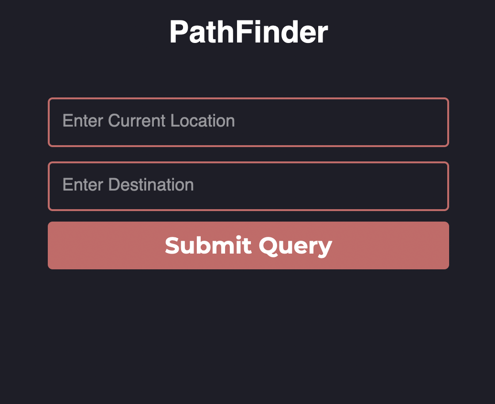
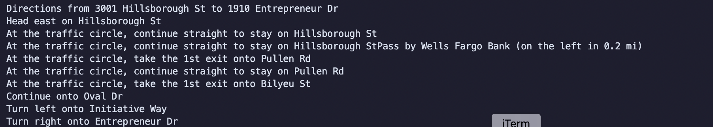

# Pathfinder 
Code for fetching and displaying directions and obd2 metrics  

---------------

## Structure ##
Breakdown of file structure:  
* **docs** - contains documentation for codebase
* **sample** - contains sample code from GitHub used for structuring this repo
* **src** - most important directory, contains code for PathFinder
* **target** - not sure what this one is for yet
* **tests** - contains code for testing

## Getting Started ##

Download this repo by running `git clone https://github.com/Marcusk19/Pathfinder.git`
or alternatively download from GitHub as zipfile and unpack it.

Main code for HUD and directions can be found in *src* 

To run code first enter working directory:
`cd pathfinder`  
Install dependencies with:
`pip install -r requirements.txt`  
Then execute binary:
`python src/HUD.py`  
Navigate to [*http://pfnder.ddns.net*](http://pfnder.ddns.net)  

From there you can enter a source and destination  
Go back to console and observe output:  

## Running in a container ##

Due to differences in local environments, it may be necessary to run the code in a container  
In order to do so you must have docker installed on your machine - follow the instructions [here](https://www.docker.com/get-started) to get started  
Download the Docker Desktop and build the image by running: `docker build -t pathfinder .`  
Check that the image has been created: `docker images`  
Run the program by using: `docker run -it pathfinder python3 src/HUD.py`  
Changes in code can be pushed to the container through: `docker build -t pathfinder:latest .`  

## Setting up your API key ##
Follow this guide [here](https://developers.google.com/maps/documentation/directions/quickstart "Google Directions") to get setup with a Google developer account and obtain your api key. 
View the `example.env` file to see how you should set up your .env file and replace `my_api_key` with the api key you received from Google.   

[TODO]
## External Docs ##
* [Source code for pfnder.ddns.net](https://github.com/Marcusk19/MQTT-web-app "webapp")
* [Docker](https://docs.docker.com/get-started/ "Getting started")
* [Tkinter](https://docs.python.org/3/library/tkinter.html "Tkinter docs")
* [Git contributing](http://www.git-scm.com/book/en/v2/Distributed-Git-Contributing-to-a-Project#Commit-Guidelines "Using git")
* [Python structuring](https://docs.python-guide.org/writing/structure/ "How to structure python code")
* [Python testing](https://docs.python-guide.org/writing/tests/ "How to test your code")
* [BeautifulSoup](https://beautiful-soup-4.readthedocs.io/en/latest/ "BeautifulSoup Documentation")
* [OBD.py](https://python-obd.readthedocs.io/en/latest/ "OBD python library")

